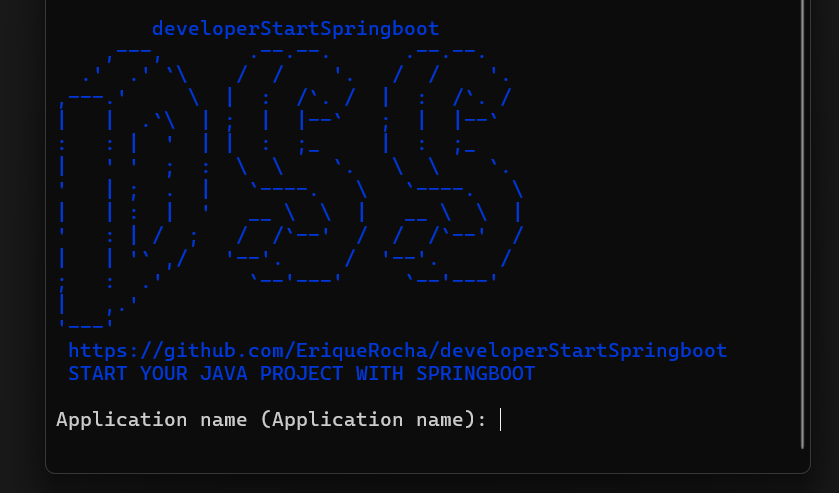

## developerStartSpringboot
This is a terminal application designed for developers starting a Spring 
Boot API who want to bypass the tedious initial steps of creating layers, 
folders, and authentication.



### How to Use
To get started, simply install the tool and run the command `dss init` in 
your terminal. Answer a few basic questions, and in seconds, you'll have 
the complete foundation for your Spring Boot API.

# how to install - Ubuntu
### option A:
```bash
curl -fsSL https://eriquerocha.github.io/developerStartSpringboot/install-deb.sh | sudo bash
```

### option B:
run the following command sequence in the terminal:
1. Download the .deb package
```bash
wget https://github.com/EriqueRocha/developerStartSpringboot/releases/download/Ubuntu-linux/developerstartspringboot_0.1.0-1_amd64.deb
```

Or, if you prefer to use curl:
```bash
curl -L -O  https://github.com/EriqueRocha/developerStartSpringboot/releases/download/Ubuntu-linux/developerstartspringboot_0.1.0-1_amd64.deb
```

2. Install the .deb package (in the folder where the package was downloaded)
```bash
sudo dpkg -i developerstartspringboot_0.1.0-1_amd64.deb
```

4. Start using
```bash
dss init
```

# how to install - Fedora
run the following command sequence in the terminal:
1. installing directly from the URL:
```bash
sudo dnf install https://github.com/EriqueRocha/developerStartSpringboot/releases/download/Fedora-linux/developerStartSpringboot-0.1.0-1.x86_64.rpm
```
### Or
downloading and installing:
1. Download the .rpm package
```bash
wget https://github.com/EriqueRocha/developerStartSpringboot/releases/download/Fedora-linux/developerStartSpringboot-0.1.0-1.x86_64.rpm
```

Or, if you prefer to use curl:
```bash
curl -L -O  https://github.com/EriqueRocha/developerStartSpringboot/releases/download/Fedora-linux/developerStartSpringboot-0.1.0-1.x86_64.rpm
```

2. Install the .rpm package (in the folder where the package was downloaded)
```bash
sudo dnf install ./developerStartSpringboot-0.1.0-1.x86_64.rpm
```

3. Start using
```bash
dss init
```

### The application is generated in three layers: core, application, and infrastructure.

| **Layer** | **Main Responsibility** | **Knows About** | **Example Classes / Components** |
|------------|-------------------------|------------------|-----------------------------------|
| **Core (Domain)** | Contains the core business logic and entities. Defines domain rules, invariants, and pure data models — completely independent of frameworks. | None | `User`, `Order`, `Product`, `Payment`, `Money`, `Email` |
| **Application** | Orchestrates use cases and coordinates the business logic using the domain entities. Handles transactions, validation, and flow control. | Core | `CreateUserService`, `ProcessPaymentUseCase`, `OrderManager`, `DtoMapper` |
| **Infrastructure** | Implements the technical details and integrates with external systems (databases, APIs, file storage, messaging, etc.). Contains controllers, repositories, and configurations. | Application (and sometimes Core) | `UserRepositoryJpa`, `PaymentApiClient`, `EmailServiceImpl`, `UserController`, `SpringConfig` |

